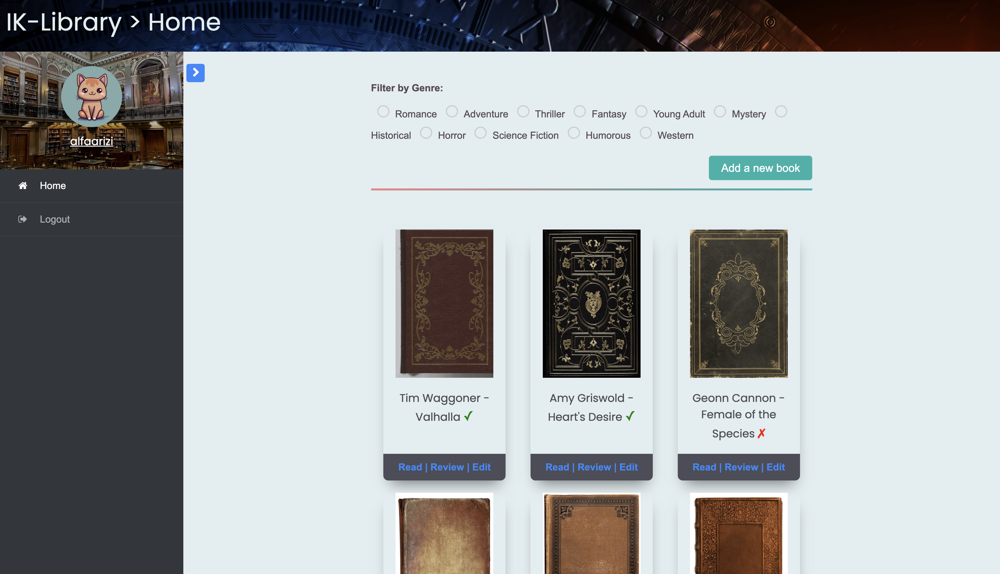
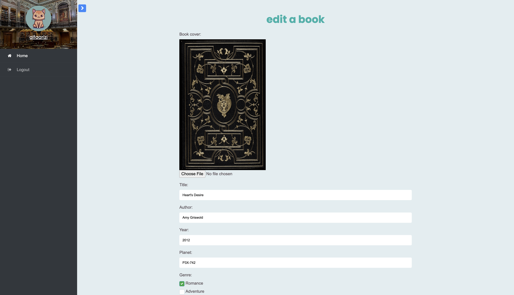
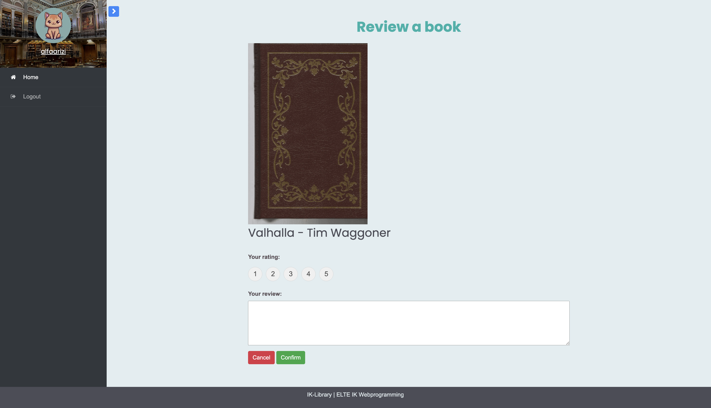
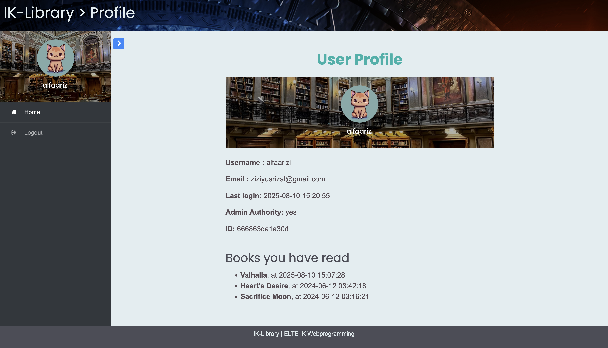

## About

This project is a web-based Library Management System that allows users to browse, review, and manage a collection of books. It supports user registration, login, book reviews, and admin features for adding or editing books, all managed through a PHP backend with JSON file storage.

## Preview

    
    

    
    

